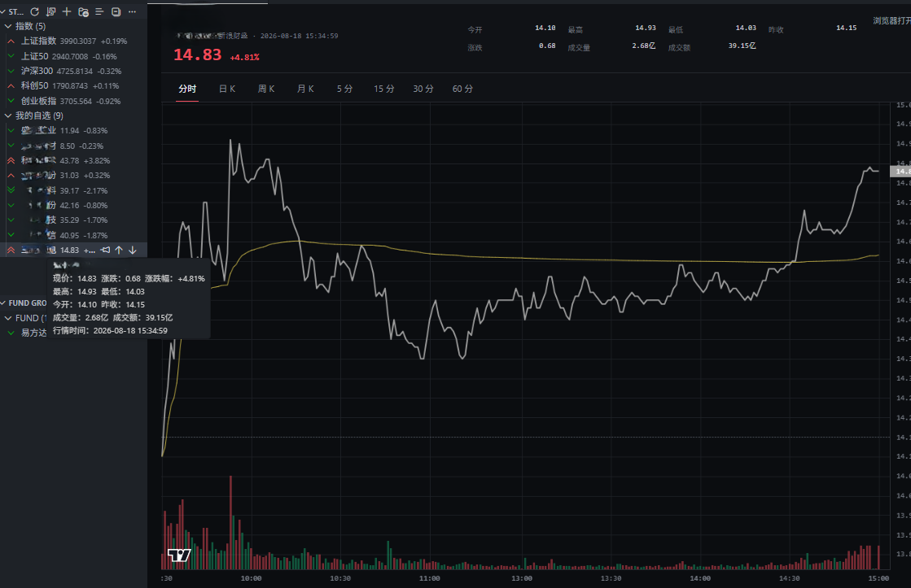
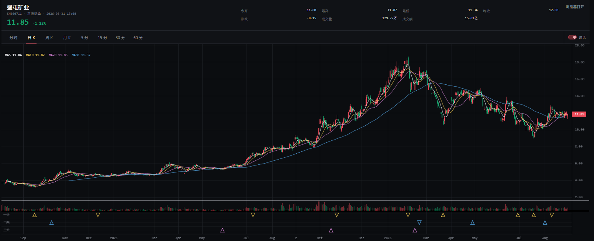

# stock-eagle-eye

一个专注于股票和基金基础行情的 VS Code 扩展。

## 功能

- 查看 A 股、港股和美股的基础行情
- 自定义股票分组：新建、重命名、删除、跨组移动和组内排序
- 支持批量粘贴股票代码，删除分组后可立即撤销
- 股票详情使用原生黑色图表，支持分时、日 K、周 K、月 K 和 5/15/30/60 分钟 K 线；K 线展示 MA5/MA10/MA20/MA60，分时图约每 5 秒刷新，分钟 K 约每 15 秒刷新
- K 线提供独立缠论信号面板，以不同颜色的空心三角形展示已确认的一、二、三类买卖点；日 K、周 K 和 5/15/30/60 分钟 K 可通过独立的 `新缠论` 开关观察通达信多尺度实验信号
- 信号三角形定位历史拐点，圆点表示实际确认位置；新缠论使用加粗且带短横线的三角形，常规交易时段内的分钟 K 未收盘时新增信号以虚线预览，收盘后才转为正式信号
- 支持本地价格与涨跌幅提醒，可修改、暂停或删除提醒，规则仅保存在本机
- 搜索并添加公募基金
- 自定义基金分组：新建、重命名、删除、跨组移动和组内排序
- 支持批量粘贴基金代码，以及股票和基金分组 JSON 导入/导出
- 查看基金最新公布的单位净值、累计净值、日涨跌幅和净值日期
- 查看基金历史单位净值与累计收益，支持 1 月、3 月、6 月、1 年和全部区间
- 状态栏展示最多 4 只自选股票
- 行情请求失败时保留最近一次成功数据
- 轮询时只请求当前开市的市场，大量自选股票自动分批获取
- 新浪股票行情失败时自动切换腾讯行情，基金请求使用受控并发和净值缓存

# 预览

## 分时

## 均线&缠论

## 数据说明

- A 股、美股基础行情：新浪财经
- 港股和股票搜索：腾讯财经
- 股票分时与 K 线：腾讯财经，失败时自动切换东方财富
- 基金搜索、最新公布净值和历史净值：东方财富
- 图表组件：[TradingView Lightweight Charts 5](https://www.tradingview.com/lightweight-charts/)

基金行情显示基金公司已经公布的净值，不是盘中实时估值。数据可能因交易日、基金公告时间或上游接口延迟而滞后。

缠论分析当前采用版本化的确定性规则。标准点等待后续走势确认；周线一买补充规则使用固定五根 K 线局部分型并排除熊市，周线二买补充规则使用牛市中结构突破后的首次更高低点，确认后不会再随末笔延伸而改写。`新缠论` 使用不重绘的多尺度反转确认，默认关闭且仅用于日 K、周 K 观察。不同流派对包含关系、笔、线段、中枢和买卖点的定义可能存在差异，该功能仍属于实验性辅助分析，不代表收益预测。

本扩展仅用于行情展示和辅助分析，不提供投资建议。
